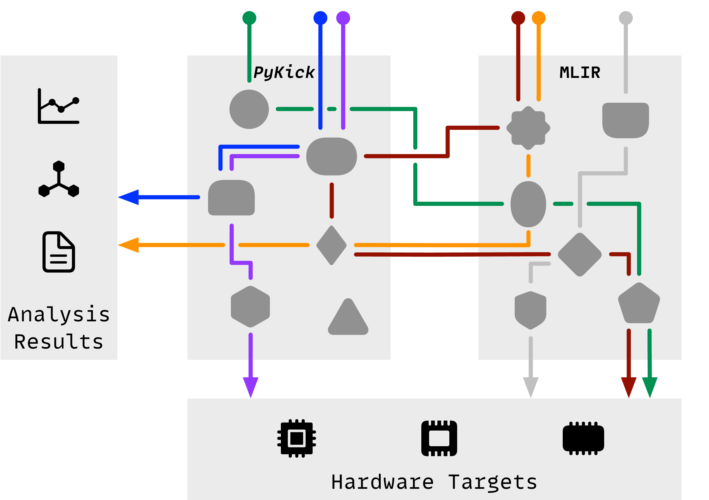
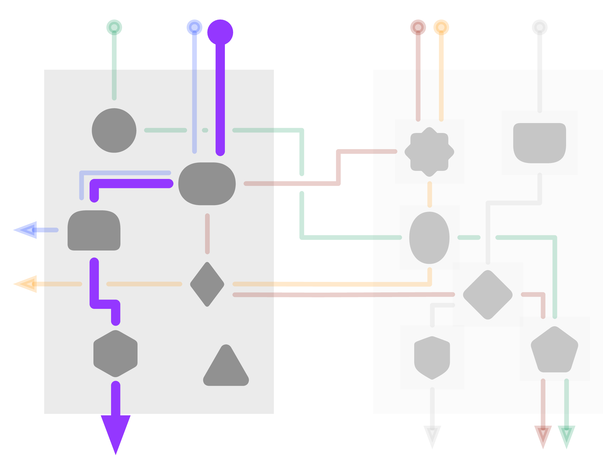
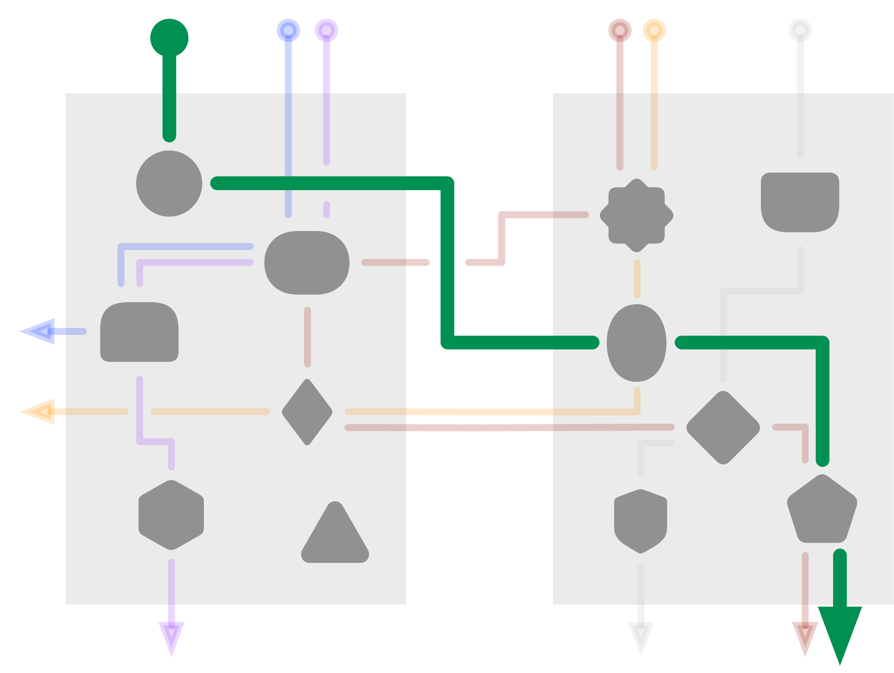
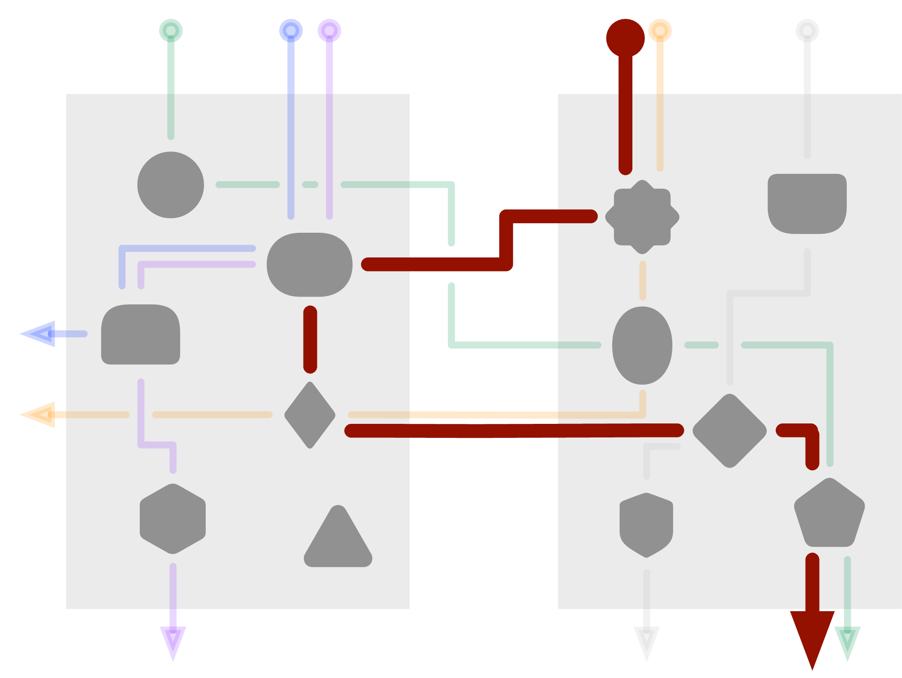
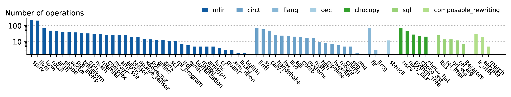
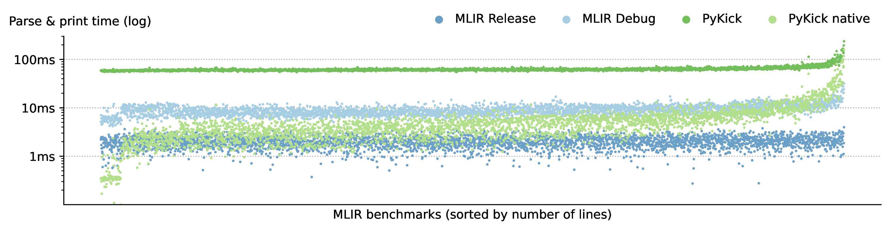

  

    <h1 class="display-4">xDSL</h1>
    
A Python-Native Compiler Design Toolkit

    <button type="button" class="btn btn-outline-primary">Learn More</button>
  

   
  

  

    

      
    

    

    

    

       
       
      

	<ul style="color:black"  class="align-middle">
	<li style="margin-bottom: 1em">Python Native</li>
	<li>State of the Art Design</li>
	<ul style="color:black">
		<li>Static Single Assignment</li>
		<li>Structured Regions</li>
		<li>Multi Level Rewriting</li>

	</ul>
	<li  style="margin-top: 1em">100% MLIR Compatible</li>
	</ul>
      

    

  

   
   
   
  

  

  <h2 style="color: #14213d">Non-Traditional Compilation Flows Made Easy</h2>
   
   

  

    

      
      

        <h5 class="card-title" style="color: white">Teaching</h5>
        
This is a longer card with supporting text below as a natural lead-in to additional content. This content is a little bit longer.

      

    

  

  

    

      
      

        <h5 class="card-title" style="color: white">DSL Frontends</h5>
        
This is a longer card with supporting text below as a natural lead-in to additional content. This content is a little bit longer.

      

    

  

  

    

      
      

        <h5 class="card-title" style="color: white">Prototyping</h5>
        
This is a longer card with supporting text below as a natural lead-in to additional content. This content is a little bit longer.

      

    

  

  

    

      
      

        <h5 class="card-title" style="color: white">Analysis</h5>
        
This is a longer card with supporting text below as a natural lead-in to additional content. This content is a little bit longer.

      

    

  

  

   
  

  <h2 style="color: #14213d">More than 30 IR Dialects from MLIR, CIRCT, Flang, ...</h2>
   
   
   
  

    

    

    

    
    

    

    

  

  

  

  <h2 style="color: #14213d">Surprisingly Fast</h2>
   
   
  

    

    

    

    
    

    

    

  

   
  

  

  <h2 style="color: #14213d">Get Started!</h2>
 

  

    

      
      

        <h5 class="card-title" style="color: white">Documentation</h5>
      

    

  

  

    

      
      

        <h5 class="card-title" style="color: white">xDSL Chat on Zulip</h5>
      

    

  

  

    

      
      

        <h5 class="card-title" style="color: white">Code on GitHub</h5>
      

    

  

  

  

  <h2 style="color: #14213d">Sneak Preview</h2>
   
   
  

  <iframe style="border: 0px; position: relative; left: -70px; top: -160px" scrolling="no" height="51100px" width="100%" src="https://nbviewer.org/github/xdslproject/xdsl/blob/main/docs/irdl.ipynb">
  

  

