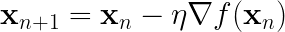
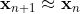
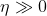
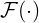
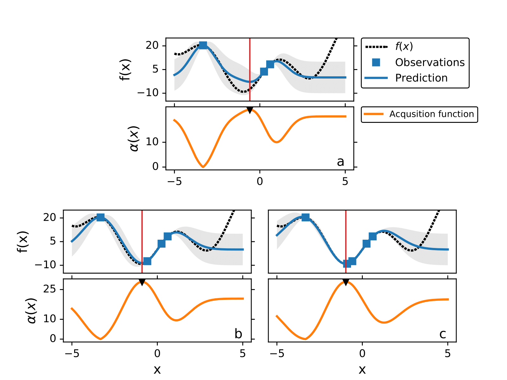

The optimization of machine learning algorithms is one of the most important research. 
Here we present a breif introduction of **Bayesian Optimization** (BO), a novel search algorithm that can minimize black-box functions.

# Introduction
The goal of an *optimization problem* is to find the best solution among all potential solutions. 
In the field of ML, the optimization problem is associated with the search for the values of the parameters of a model that better described the problem, e.g. minimizing a loss function. 
Synthetic chemistry also has optimization problems, for example varying the reaction conditions to increase percent yield.

The optimization of a function is also a supervised learning problem, but instead of finding the best global representation of function ), the goal is to find the   where ) is minimum,

The most common optimization algorithm for continuous functions is *gradient descent* (GD). GD algorithm is designed to minimize a function iteratively by displacing the current point in the direction of the negative gradient of the function,

where the parameter  is known as the *learning rate*.
 is also related in the trade-off between exploitation and exploration and plays a key role in the convergence of the algorithm.   
For example, when  is small GD is exploiting ; where as    is related to exploration. 
GD is one of the first optimization algorithms used to train NNs, backpropagation algorithm. 

GD has been a widely successful optimization algorithm.
However, not every function can be optimized using GD.
For example, there is no analytic function that describes the relation between the percent yield given some experimental conditions for a chemical reaction, therefore one can not use GD to increase the percent yield.
There are many other problems that are described by non-analytic functions or *black-box* functions, where evaluations are point-wise.
BO is designed to tackle the optimization of black-box functions where gradients are not available.  
For obvious reasons, trying to find the minimum of ) by randomly sampling is not the smartest strategy, since it may take a large number of evaluations from ) before finding the minimum.
BO tries to infer the location of the minimum of a black-box function by proposing a smarter iterative sampling scheme. 
In the case of GD we assume that the gradient gives us the information of where to sample the next point in order to get closer to the minimum. 
Considering that black-box functions do not have a gradient, it is necessary to propose a metric that quantifies the informational gain as a function of the space.

The core of BO relays in two components,
1.  --> **model** that mimics the black-box function.
2. )  --> **acquisition function** that quantifies the information gain for a given
point.

To mimic the unknown function ) we can use any supervised learning algorithm, like NNs. 
However, if  is not capable to learn at every iteration, we may waist some of the evaluations because of the lack robustness of the model. 
GP models are a great candidate for  due to the accuracy and robustness to interpolate any continuous function. 
Additionally, the ability of GP models to quantify the prediction's uncertainty ) without the need of extra data is what makes them the strongest candidate for BO. 
In a previous post we introduced [Gaussian Processes](intro_GP.md), a probabilist regression model capable of learning complex functions. 

The following figure illustrates how BO works to find the minimum of ) without using gradients.
The maximum of the acquisition function is the query point where the black-box function is evaluated next, ), % since it represents the point with the greatest informational gain. 
 and at each iteration we add the new point  to the training data and retrain the GP model. 

 
Pseudocode of BO,

## Acquisition function
In this section we explain different acquisition functions that are used in BO. 
BO is an optimization algorithm designed for problems where gradients are not available. 
As it was mention above, the acquisition function is designed to repre- sent which point in the space has the most information. 
By iteratively evaluating the black-box function where the acquisition function is maximum we learn a more certain representation of ) where the minimum could be. There are many different acquisition functions, here we cover the three most used,
1. Probability of improvement (PI) 
2. Expected Improvement (EI)
3. Upper confidence bound (UCB)

