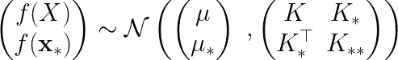
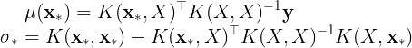
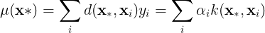
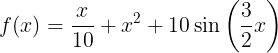
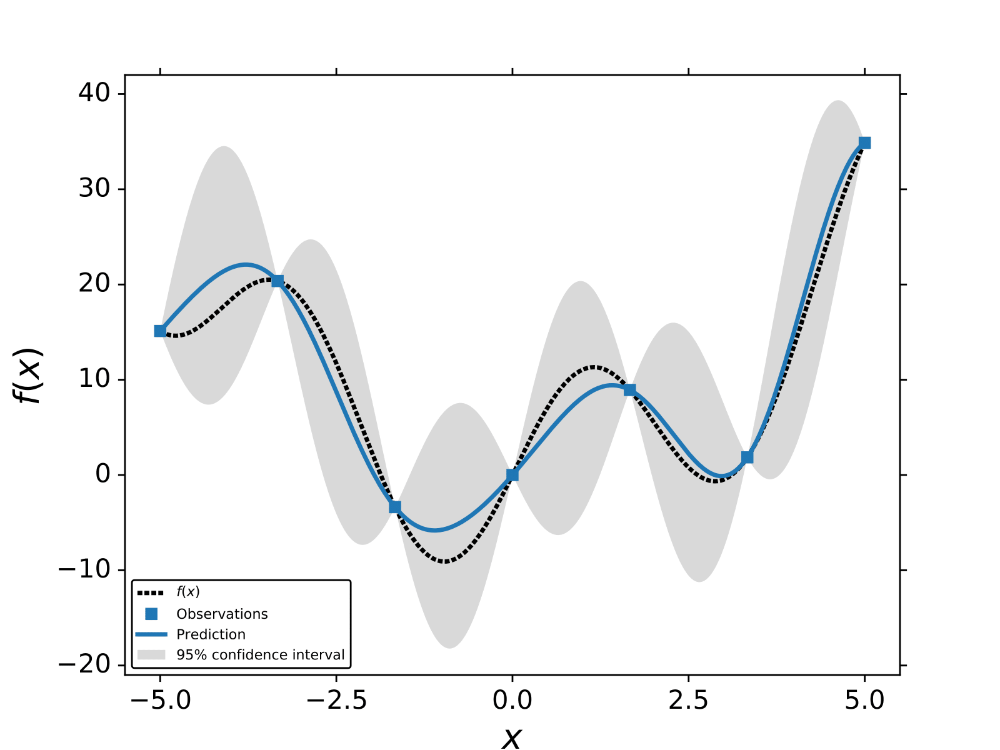
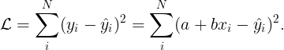
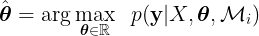
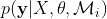
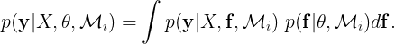
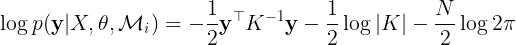

In the field of machine learning, the branch of supervised learning is focuse on the regression task, . 

Machine learning (ML) field is divided into three major areas; supervised, unsupervised, and reinforcement learning (MurphyMLbook,BishopMLbook,RLbook). 
Each of these three fields studies a particular task. In the case of supervised learning, the goal is to find the numerical mapping between an input  and an output . The numerical mapping can be viewed as, ). When the output value  is discrete, the problem is known as *classification*. On the other hand, when   is continuous is known as *interpolation*. This chapter describes one of the most common supervised learning algorithms Guassian process (GP) regression (GPbook). 

# Introduction
As in any other supervised learning algorithm, the goal of GP regression is to infer an unknown function ) by observing some input, , and output data, . 
We denote  as the training dataset that contains both  and .
 One of the few differences between GP regression and other supervised learning algorithms, like neural networks (NNs), is that GP infer a *distribution over functions* given the training data ). 
 
GPs are a probabilistic method and assume that each training point is a random variable and they have a joint probability distribution , \cdots, f(\mathbf{x}_N))). 
As its name suggests, GP assume that the joint distribution is Gaussian and has a mean ) and covariance ). 
The matrix elements of the covariance are defined as ) where ) is a positive defined kernel function. The kernel function plays a key role as it describes the *similarity* relation between two points.
A GP is denoted as,   \sim GP \left ( \mu(\mathbf{x}), K(\mathbf{x},\mathbf{x'}) \right)).

In the following sections, we describe the training and prediction of GP regression.

# Prediction with Gaussian Processes
GPs can also be considered as a generative model, however, one if its advantages is that their predictive distribution has a close form, meaning sampling techniques are not required. 
As it was mentioned above, a GP is the collection of random variables ) that follow a joint distribution. 
The joint Gaussian distribution between , , and ) is of the form,

where  is the covariance matrix of the training data *X*,  is the covariance matrix between *X* and , and  is the covariance with respect to itself. 

The probability distribution over ) can be inferred by computing the conditional distribution given the training data, ). 
Conditioning on the training data is the same as selecting the distribution of functions that agree with observed data points .
The mean and covariance matrix of the conditional distribution are,

 where  is the predicted variance for . The mean of the conditional distribution can be rewritten as,

where ^\top K(X,X)^{-1}) and  ^{-1}\mathbf{y}). 
The mean of the conditional distribution is a linear combination of the training data, , or a linear combination of the kernel function between the training points and . Function ) can be understood as a *distance* function.
It is important to state that the accuracy of the prediction with GPs directly depends on the size of the training data *N* and the kernel function ). In the following sections, we illustrate the impact that different kernels on GPs' prediction. 

In the GPs' framework, the predicted variance or standard deviation of  represents the uncertainty of the model. 
The uncertainty can be used to sample different regions of the function space to search the location of the minimum or maximum of a particular function.
This is the idea behind a class of ML algorithms known as Bayesian optimiation.

An example of GP regression for,
.
We use the *exponential squared* kernel  and 7 training points.
In the following section, we describe the most common procedure to train GPs.

# Training GPs
The goal of any supervised learning algorithm is to infer a function ), as accurately as possible, given some example data.
In order to quantify the accuracy of a model we define a *loss* function, , for example, the difference between the prediction  and the real value  (training points) such as  ^2) or .
The parameters of the model  and  are interconnected. 
To illustrate this idea let us assume that ) is a simple linear regression model, =a %2B bx). The loss function for such model is, 

From the previous equation, we can observe that the value of  depends on *a* and *b*. 
It can be argued that when  is large ) not equal to. On the other hand when  \approx \hat{y_i}) the value of  will tend to zero.
Using a loss function to tune the parameters of ) is known as the *training* stage in ML. 
It must be mentioned that replicating the training data could also mean that  the model ''memorize'' the training data. 
This common problem in ML is known as *overfitting*. 

GPs models can also be trained using a loss function. GP models are non- parametric models, therefore, the dimensionality of the loss function depends on the number of the parameters of the kernel function. Using a loss function to determine the optimal value for the kernel parameters for non-parametric models is computationally expensive and is prone to overfitting. However, it is possible to train GP methods without a loss function. The most common way to train GPs is by finding the kernel parameters (**θ**) that maximize the **marginal likelihood function**,

where  is the marginal likelihood for a given model or kernel function Mi. Finding the value of **θ** where  is maximized is known as type II maximum likelihood (ML-II). The marginal likelihood or evidence is defined as,

In the case of GPs, the marginal likelihood has a closed form. Finding the kernel parameters that maximize the marginal likelihood can be done by maximizing the logarithm of the marginal likelihood w.r.t to **θ**,

where the first term is known as the data-fit term, the second term reflects the complexity of the model , and the third term is a constant that depends on the number of training points, *N*. The value of  mainly depends on the data-fit and complexity terms. For instance, for a **θ** that memorizes the training data the value of log|K| is large, while 
 will be small. The tradeoff between the data-fit and the complexity term is key for the optimal value of the kernel parameters.

