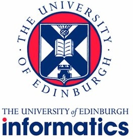

## School of Informatics (University of Edinburgh)

The School of Informatics leads this project, with Dr Tobias Grosser (the project PI) and Dr Michel Steuwer who are compiler, MLIR and LLVM experts. Being active collaborators to the MLIR and LLVM communities, they bring expertise around the development of appropriate MLIR dialects, the mechanism to connect Python based DSLs with MLIR, and integration with LLVM. Furthermore, their wide connections throughout the compiler communities means that the project is able to engage closely with that community and act as a bridge between people working in HPC and compilers.

---

## Department of Computing (Imperial College London)

Professor Paul Kelly and Dr Gerard Gorman provide DSL expertise to the project. Leading the development of numerous DSLs, including the popular and widely successeful Devito, their knowledge and experience is invaluable to ensure that the ecosystem being developed is wide ranging across DSLs. Furthermore, Devito is an explicit target of this project, using the Python-based MLIR integration toolbox that we will develop to integrate this DSL with our ecosystem. Additionally Paul and Gerard bring significant experience of working with seismic community, cloud computing, and interactive HPC technologies such as Jupyter notebooks, all of which are important considerations in this project to ensure that the DSL eco-system we will develop can interoperate with.

---

## EPCC (University of Edinburgh)

EPCC is the UK's leading supercomputing centre, with Dr Nick Brown and Dr Amrey Krause providing HPC expertise at both the technology and application level. This includes expertise with a number of the project's target applications that we will be using as vehicles to evaluate the developed eco-system. During the project we will be using many of EPCC's hosted HPC systems which range from large-scale production machines such as the ARCHER2 UK national supercomputer, to more experimental systems such as the Cerebras CS-1 which contains a highly innovative massive-core CPU. 
