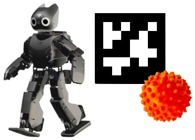

## Introdução

<!--img src="assets/img/walker/walker_semelhantes.png" width="350"
-->

Este projeto visa a construção de um robô autônomo bípede para exploração em um ambiente indoor controlado.

Para concepção do robô Walker, buscamos por projetos similares existentes, com o intuito de nortear nosso desenvolvimento.
A imagem anterior ilustra as principais referências utilizadas para o projeto. 

Da esquerda para direita: ROFI [1], Darwin-OP [2] e NAO [3]

## Missão

<!--<td></td>-->

Como missão do robô Walker, ele deverá explorar uma área delimitada em busca de uma TAG. 
Ao encontrá-la, ela indicará a posição de uma esfera no ambiente. 
O Walker deverá, então, deslocar-se até essa posição e encontrar a esfera.

## Como ele fará isso?

<!---->

Para desempenhar suas funções, o Walker contará com alguns componentes. 
Dentre eles, os principais são:
- **Raspberry Pi 4:** Será a central de processamento do robô, controlando todo seu funcionamento
- **Dynamixels XM430:** Atuadores que irão possibilitar o deslocamento do robô sobre dois pés
- **Sensores Ultrassônicos HC-SR04:** Permitirão a detecção de obstáculos, possibilitando sua navegação autônoma
- **Raspicam:** A câmera será utilizada para a detecção e reconhecimento de TAGs, possibilitando sua localização

## Equipe
<table border="0">
  <tr>
    <td><b style="font-size:15px">
**Brenda Alencar**</b></td>
    <td><b style="font-size:15px">
 **Felipe Mohr** </b></td>
  </tr>
  <tr>
    <td>
</td>
    <td>
</td>

  </tr>
  <tr>
    <td>
 Estagiária no CC RoSA, graduanda em Eng. Elétrica.   Participou de projetos de Robótica Subaquática e   Manipuladores Subaquáticos </td>
    <td>
 Estagiário no CC RoSA, graduando em Eng. Elétrica.   Participou de projetos de Robótica Subaquática e   Robótica Móvel</td>
  </tr>
</table>

## Referências
1. [ROFI](http://www.projectbiped.com/prototypes/rofi). **RObot FIve**. Acesso em: 7 de Junho de 2021 .
1. [Darwin-OP](https://emanual.robotis.com/docs/en/platform/op/getting_started). **ROBOTIS OP**. Acesso em: 7 de Junho de 2021.
1. [Nao](https://www.softbankrobotics.com/emea/en/nao). **NAO ROBOTIS SoftBank Robotics**. Acesso em: 7 de Junho de 2021.
