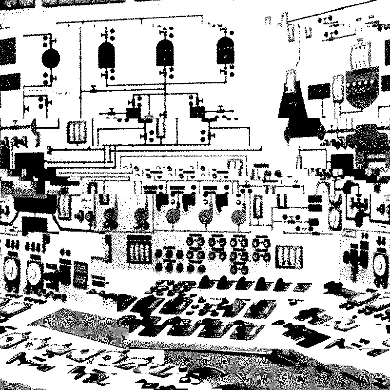

will need index function

Michalec, O., Shreeve, B. and Rashid, A. (2023) Who will keep the lights on? Expertise and inclusion in cyber security visions of future energy systems. Energy Research and Social Science, 

Michalec, O., Milyaeva, S. and Rashid, A. (2022) When the future meets the past: can safety and cyber security coexist in modern critical infrastructures? Big Data and Society. 

Di Cara, N., Zelenka, N., Day, H., Bennet, E., Hanschke, V., Maggio, V., Michalec, O et al. (2022). Data Ethics Club: Creating a Collaborative Space to Discuss Data Ethics. Patterns. 

O’Donovan, C., Michalec, O., Moon, J. (2021) Capabilities for transdisciplinary research. Research Evaluation. Available here.

Michalec, O., Milyaeva, S. and Rashid, A. (2021) Reconfiguring governance: How cyber security regulations are reconfiguring water governance. Regulation and Governance. Available here.

Michalec, O., van der Linden, D., Milyaeva, S. and Rashid, A. (2020) Industry Responses to the European Directive on Security of Network and Information Systems (NIS): Understanding policy implementation practices across critical infrastructures. Symposium on Usable Privacy and Security

