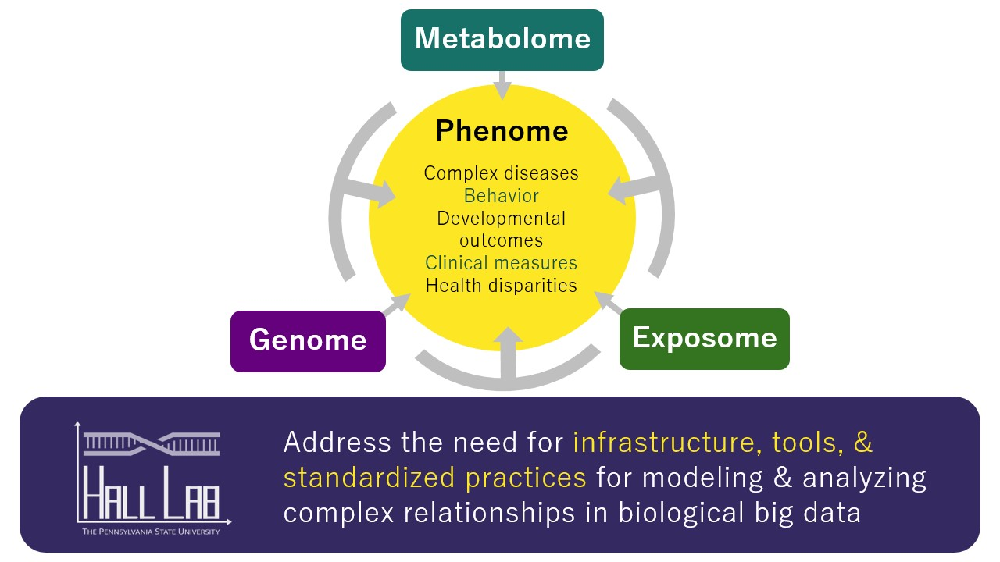

The Hall Lab is focused on building computational tools to elucidate the complex genetic and environmental underpinnings of human traits. We integrate genetic (genotype, sequence, structural variation) and exposure (derived from surveys and metabolomics methods) big data to predict disease status. The ultimate goals of this work are to 1) enrich our understanding of the complex mechanisms that lead to common disease and 2) provide methods to identify those most at risk of developing disease (based on their genetic and exposure backgrounds) in a clinical setting.

# Environment and GxE

Knowledge of the impact of exposures on health can reveal individual or combinations of exposures that confer risk. Further, elucidating the nature of GxE interactions will help to determine the impact of alterations in biological pathways that are only predictive of disease under specific environmental conditions. Ultimately, our goal is to build on existing knowledge about genetic and environmental complexity in order to guide environmental policies to protect vulnerable populations.

# Genetic Interactions

Gene products do not function in isolation in biology; rather, they interact with one another physically within pathways. Embracing complexity by exploring GxG interactions, or epistasis, is likely to explain much of the missing heritability because traits arise from the vastly dynamic and interconnected systems in biology. A goal of our lab is to best model this complexity with the most appropriate genetic encoding methods for identifying true GxG.

# Phenotype Complexity

Current results from the GWAS Catalog reveal numerous loci associated with more than one phenotype class. However, these results were compiled from many different datasets. Phenome-wide association studies (PheWAS) offer a complementary approach to GWAS and the means to unveil existing interrelationships across traits and identify genetic variants exhibiting cross-phenotype associations. This approach involves simultaneous assessment of association between genetic variants and a diverse set of phenotypes.
